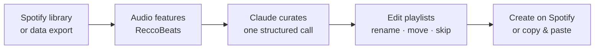

# Playlist Curator

Turn your messy Spotify listening into a handful of playlists that actually hang together, grouped by genre, era, energy and mood, then named by Claude.

**[Try it →](https://spotify-playlist-curator-black.vercel.app)**

- **Upload your Spotify data** (open to everyone). Drop in the export from Spotify's privacy page, get playlists back, and paste them into Spotify.
- **Connect Spotify** (invite-only). Reads your library directly and creates the playlists on your account in one click.

## How it works



1. **Collect.** The signed-in flow pulls recent plays, top tracks (4 weeks, 6 months, all time) and liked songs. The upload flow parses the export **in your browser**, aggregating years of play history into lifetime play counts. Only track ids, titles, artists and play counts reach the server. Raw history, which includes IP addresses and devices, never leaves your device.
2. **Enrich.** Each track gets measured audio features (energy, valence, danceability, acousticness, instrumentalness, speechiness, tempo) from [ReccoBeats](https://reccobeats.com).
3. **Curate.** The whole library goes to Claude in a single request with a JSON-schema response format. Claude groups tracks so each playlist coheres on several axes at once (genre family, era, tempo and mood), names it, and puts tracks that don't fit anywhere in an *Unsorted* pile instead of forcing them in. The server then enforces the invariants (valid ids, each track used at most once, every track accounted for) whatever the model returns.
4. **Review.** Rename playlists, move tracks between them, skip ones you don't want, and play 30-second previews (via Deezer). Progress is saved locally, so a reload doesn't cost another run.
5. **Export.** The signed-in flow creates private playlists with generated gradient covers, one request per playlist so failures can be retried individually. The upload flow copies track links: paste them into an empty playlist in the Spotify desktop app and every track is added.

### Why not k-means?

An earlier version scored every track on 13 LLM-guessed "vibe" dimensions and clustered them with k-means. It produced mush. The dimensions were heavily correlated, so clusters mostly split on energy, and nothing kept genre or era together. Asking one model to curate the whole library, with measured audio features as evidence, turned out to be simpler and far better.

## Working with Spotify's API in 2026

If you're building on the Spotify Web API, this is the useful part. Apps in **Development Mode** (every app without an extended-quota agreement) have lost a lot since late 2024:

| Removed or restricted | Replacement used here |
|---|---|
| `GET /audio-features` (Nov 2024) | [ReccoBeats](https://reccobeats.com) audio features, keyed by Spotify id, max 40 ids per request |
| `preview_url` on tracks (Nov 2024) | Deezer previews looked up by ISRC, with a search fallback. URLs expire after ~15 min, so they're fetched on demand |
| `GET /artists?ids=` batch, artist `genres` deprecated (Feb 2026) | Claude's own knowledge of the artists |
| `popularity`, `available_markets` on tracks (Feb 2026) | Not needed |
| `POST /users/{id}/playlists` → `POST /me/playlists` (Feb 2026) | Migrated |
| `POST /playlists/{id}/tracks` → `POST /playlists/{id}/items` (Feb 2026) | Migrated |

Development Mode also requires the app owner to have **Premium** and caps an app at **5 allowlisted users**. That cap is why the public path here is the data-export upload, which needs no Spotify API access at all. See Spotify's [February 2026 migration guide](https://developer.spotify.com/documentation/web-api/tutorials/february-2026-migration-guide).

## Stack

Next.js 15 (App Router) · TypeScript · Tailwind · Auth.js (Spotify OAuth) · Anthropic SDK (Claude Opus 5) · Upstash Redis rate limiting · zod · Vitest · Vercel

## Run it locally

**Prerequisites:** Node 20+, a Spotify account with Premium (required to own a dev-mode app), and an [Anthropic API key](https://console.anthropic.com).

1. **Create a Spotify app** at [developer.spotify.com/dashboard](https://developer.spotify.com/dashboard). Select *Web API*, and add the redirect URI `http://127.0.0.1:3000/api/auth/callback/spotify`. Spotify no longer accepts `localhost`, so browse to `127.0.0.1` locally. Under *User Management*, add the Spotify accounts that may sign in.
2. **Configure and run:**

   ```bash
   git clone https://github.com/KJ-11/spotify-playlist-curator.git
   cd spotify-playlist-curator
   npm install
   cp .env.example .env.local   # fill in AUTH_SECRET, AUTH_SPOTIFY_ID/SECRET, ANTHROPIC_API_KEY
   npm run dev
   ```

3. Open [http://127.0.0.1:3000](http://127.0.0.1:3000).

The upload flow works without the Spotify credentials. Redis is optional locally: without it, rate limits are skipped.

## Deploy your own

[](https://vercel.com/new/clone?repository-url=https%3A%2F%2Fgithub.com%2FKJ-11%2Fspotify-playlist-curator&env=AUTH_SECRET,AUTH_SPOTIFY_ID,AUTH_SPOTIFY_SECRET,ANTHROPIC_API_KEY&envDescription=See%20.env.example%20for%20what%20each%20variable%20does)

1. Deploy, then add your production redirect URI (`https://<your-domain>/api/auth/callback/spotify`) to the Spotify app.
2. Add **Upstash Redis** from the Vercel Marketplace (Storage tab) and connect it to the project. Without it, the public upload flow refuses to curate in production, so an open endpoint can't run up your Anthropic bill.
3. Redeploy so the new environment variables take effect.

Hosting your own copy is also the way around the 5-user cap: each deployment gets its own allowlist.

## Configuration

| Variable | Required | Purpose |
|---|---|---|
| `AUTH_SECRET` | yes | Auth.js session encryption (`openssl rand -base64 32`) |
| `AUTH_SPOTIFY_ID`, `AUTH_SPOTIFY_SECRET` | for the Spotify flow | Spotify app credentials |
| `ANTHROPIC_API_KEY` | yes | Claude API key, preferably workspace-scoped |
| `ANTHROPIC_WORKSPACE_ID` | no | Needed only if the key isn't scoped to a workspace |
| `UPSTASH_REDIS_REST_URL`, `UPSTASH_REDIS_REST_TOKEN` | in production | Rate limiting (`KV_REST_API_URL` / `KV_REST_API_TOKEN` also work) |
| `CURATE_LIMIT_PUBLIC` | no | Curations per IP per day in the upload flow (default 3) |
| `CURATE_LIMIT_SPOTIFY` | no | Curations per IP per day for signed-in users (default 20) |
| `CURATE_LIMIT_GLOBAL` | no | Curations per day across all users (default 300) |
| `CURATION_ENABLED` | no | Set to `false` to pause curation, e.g. if costs spike |

## Project structure

```
src/
├── app/
│   ├── page.tsx                  # landing: choose upload or Spotify
│   ├── upload/page.tsx           # public flow: export in, copy-paste out
│   ├── curate/page.tsx           # signed-in flow: library in, playlists created
│   └── api/
│       ├── library/              # GET  signed-in library + audio features
│       ├── enrich/               # POST audio features for export tracks
│       ├── curate/               # POST one Claude call → playlists (rate limited)
│       ├── push/                 # POST create one playlist on Spotify
│       └── preview/              # GET  30s preview URL via Deezer
├── components/
│   ├── board/                    # editable results view shared by both flows
│   ├── spotify/ · upload/ · ui/
├── hooks/                        # board state, push queue, persisted state
└── lib/
    ├── client/                   # browser-only: export parser, cover art, API client
    ├── server/                   # server-only: Spotify client, curation, rate limits, schemas
    ├── types.ts                  # shared domain types
    └── errors.ts                 # typed error codes shared with the client
```

## Scripts

```bash
npm run dev         # dev server
npm run check       # lint + typecheck + tests (what CI runs, plus a build)
npm test            # unit tests
```

## Limitations

- Copy-and-paste into a playlist works in the Spotify **desktop** app, not on mobile.
- Extended streaming history exports can take Spotify up to 30 days to deliver. The faster *Account data* export works too, with less history.
- ReccoBeats doesn't cover every track. Tracks without audio features are still curated, using title and artist alone.
- ReccoBeats and Deezer are free third-party services. Both are treated as best-effort and never block a run.

## License

[MIT](LICENSE)
