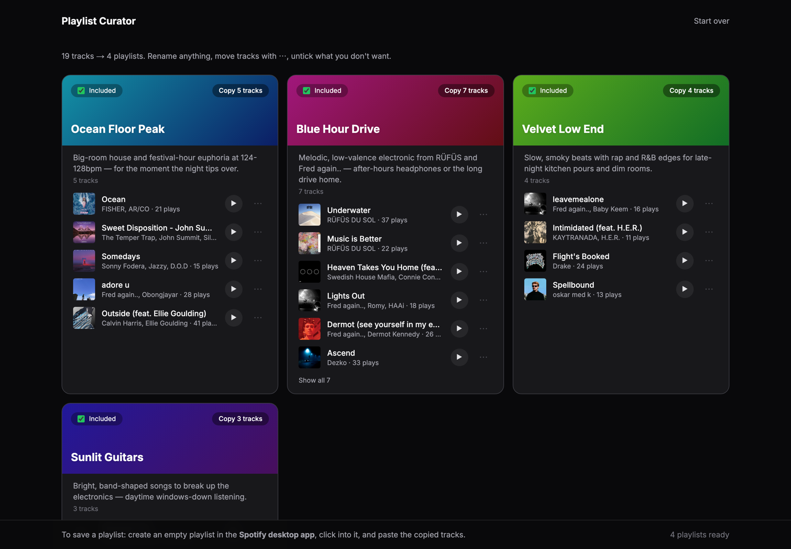

# Playlist Curator

[](https://github.com/KJ-11/spotify-playlist-curator/actions/workflows/ci.yml)
[](https://github.com/KJ-11/spotify-playlist-curator/actions/workflows/smoke.yml)
[](LICENSE)

Turn your messy Spotify listening into a handful of playlists that actually hang together: grouped by genre, era, energy and mood, then named by Claude.

**[Try it live →](https://spotify-playlist-curator-black.vercel.app)**



## Two ways to use it

| | Upload your Spotify data | Connect Spotify |
|---|---|---|
| **Who** | Anyone | Up to 5 allowlisted accounts |
| **Input** | Your Spotify data export, read in the browser | Your library, read via the Spotify API |
| **Output** | Copy the tracks, paste into a Spotify playlist | Playlists created on your account in one click |

## How it works

1. **Collect.** Pull recent plays, top tracks and liked songs, or parse years of play history from your data export. Parsing happens in your browser; only track ids, titles, artists and play counts reach the server.
2. **Enrich.** Look up measured audio features (energy, mood, danceability, acousticness, tempo) from [ReccoBeats](https://reccobeats.com).
3. **Curate.** Send the whole library to Claude in one structured request. Each playlist has to hold together on genre, era, tempo *and* mood. Anything that doesn't fit goes to *Unsorted*.
4. **Edit and export.** Rename, move tracks, skip playlists and play 30-second previews, then create the playlists on Spotify or copy them over.

<details>
<summary><b>Why Claude instead of clustering?</b></summary>

An earlier version scored every track on 13 model-guessed "vibe" dimensions and ran k-means. The dimensions were heavily correlated, so clusters mostly split on energy and nothing kept genre or era together. Handing one model the whole library, with measured audio features as evidence, was simpler and much better. The server still enforces the rules itself (valid ids, each track used once, every track accounted for), whatever the model returns.
</details>

<details>
<summary><b>Building on the Spotify API in 2026</b></summary>

Apps in Spotify's **Development Mode** lost a lot of the Web API between late 2024 and early 2026, and they're capped at 5 users with a Premium owner. What changed, and what this project uses instead:

| Gone | Used instead |
|---|---|
| `GET /audio-features` | ReccoBeats, keyed by Spotify id (max 40 per request) |
| `preview_url` on tracks | Deezer previews by ISRC, looked up on demand (URLs expire in ~15 min) |
| `GET /artists?ids=`, artist `genres` | Claude's own knowledge of the artists |
| `POST /users/{id}/playlists` | `POST /me/playlists` |
| `POST /playlists/{id}/tracks` | `POST /playlists/{id}/items` |

The 5-user cap is why the public path is the data-export upload: it needs no Spotify API access at all. Details: Spotify's [February 2026 migration guide](https://developer.spotify.com/documentation/web-api/tutorials/february-2026-migration-guide).
</details>

## Run it locally

You need Node 20+, an [Anthropic API key](https://console.anthropic.com), and, for the Spotify flow, a Spotify app. That requires Spotify Premium.

```bash
git clone https://github.com/KJ-11/spotify-playlist-curator.git
cd spotify-playlist-curator
npm install
cp .env.example .env.local   # fill in the values
npm run dev
```

Open [http://127.0.0.1:3000](http://127.0.0.1:3000). Spotify rejects `localhost` redirect URIs, so use the IP.

For the Spotify flow, create an app at [developer.spotify.com/dashboard](https://developer.spotify.com/dashboard) with the redirect URI `http://127.0.0.1:3000/api/auth/callback/spotify`, and add yourself under *User Management*. The upload flow works without it.

## Deploy your own

[](https://vercel.com/new/clone?repository-url=https%3A%2F%2Fgithub.com%2FKJ-11%2Fspotify-playlist-curator&env=AUTH_SECRET,AUTH_SPOTIFY_ID,AUTH_SPOTIFY_SECRET,ANTHROPIC_API_KEY&envDescription=See%20.env.example%20for%20what%20each%20variable%20does)

After deploying:
1. Add `https://<your-domain>/api/auth/callback/spotify` as a redirect URI in your Spotify app.
2. Add **Upstash Redis** from the Vercel Marketplace and connect it. Without it, public curation is switched off in production so nobody can run up your Anthropic bill.
3. Redeploy.

Your own deployment gets its own 5-user Spotify allowlist.

<details>
<summary><b>Environment variables</b></summary>

| Variable | Needed for | Purpose |
|---|---|---|
| `AUTH_SECRET` | always | Session encryption: `openssl rand -base64 32` |
| `ANTHROPIC_API_KEY` | always | Claude API key (workspace-scoped) |
| `AUTH_SPOTIFY_ID` / `AUTH_SPOTIFY_SECRET` | Spotify flow | Spotify app credentials |
| `UPSTASH_REDIS_REST_URL` / `_TOKEN` | production | Rate limiting (`KV_REST_API_URL` / `_TOKEN` also work) |
| `ANTHROPIC_WORKSPACE_ID` | optional | Only if your key isn't workspace-scoped |
| `CURATE_LIMIT_PUBLIC` | optional | Curations per IP per day, upload flow (default 3) |
| `CURATE_LIMIT_SPOTIFY` | optional | Curations per IP per day, signed in (default 20) |
| `CURATE_LIMIT_GLOBAL` | optional | Curations per day, everyone (default 300) |
| `CURATION_ENABLED` | optional | `false` pauses curation |
</details>

## Development

```bash
npm run check        # lint, typecheck, unit tests
npm run test:smoke   # checks against the live deployment (SMOKE_CURATE=1 adds a real curation)
```

Smoke tests also run after every production deploy and daily, to catch breakage in Spotify, ReccoBeats or Deezer.

<details>
<summary><b>Project layout</b></summary>

```
src/
├── app/                 # pages (/, /upload, /spotify) and API routes
├── components/          # board (results view), spotify, upload, ui
├── hooks/               # board state, push queue, persisted state
└── lib/
    ├── client/          # browser-only: export parser, covers, API client
    ├── server/          # server-only: Spotify, curation, rate limits, schemas
    ├── types.ts
    └── errors.ts
smoke/                   # production smoke tests
```
</details>

## Limitations

- Pasting tracks into a playlist works in the Spotify **desktop** app only.
- The full streaming-history export can take Spotify up to 30 days. The faster *Account data* export works too, with less history.
- Some tracks have no audio features; they're curated from title and artist.
- Spotify gives Development Mode apps a small request quota shared across the developer's account. Heavy use can pause the Connect Spotify flow for hours; the upload flow is unaffected.

## License

[MIT](LICENSE)
